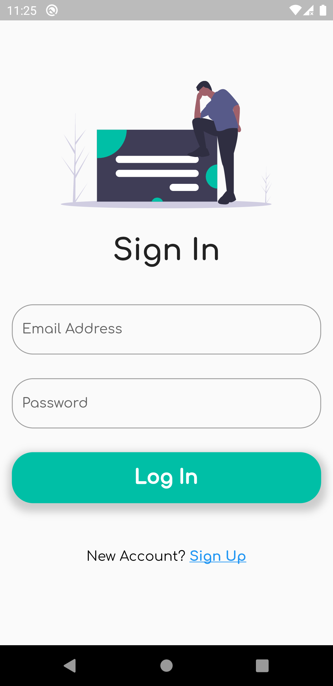
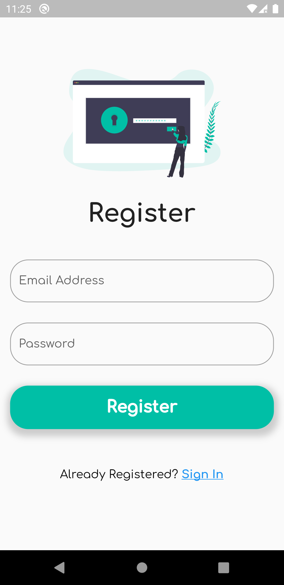
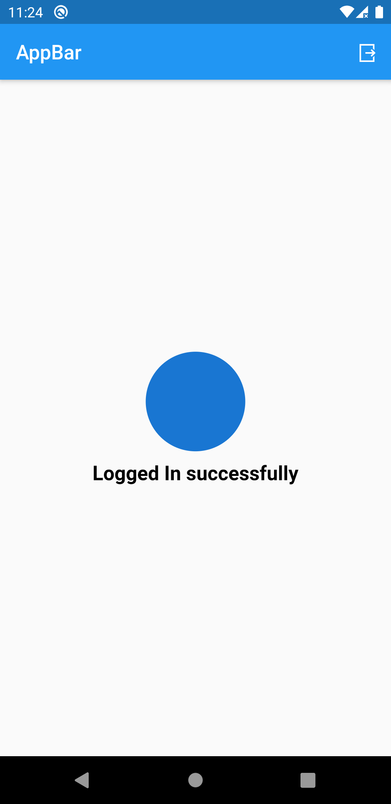

# DND App Clone

A Project build as a clone from a project saw on twitter.

## Getting Started

This project will show how a user can sign in with

- Google Sign In
- Facebook Sign In
- Sign In with Email

## Screenshots

  
  
  
  
  
  
  

